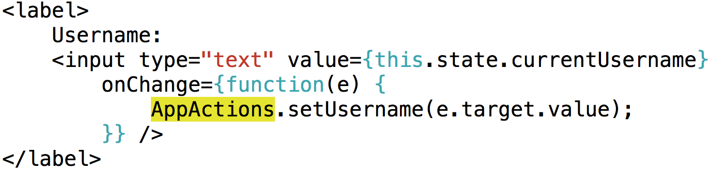

# [fit] Building submarines
# [fit] that don't leak

^ Hi, I'm Aria from Khan Academy!

------


^ We've all heard a lot about how using
reactive components can help you get
tighter containers, faster cores, and
more funding. One-way flow can power
your fuel centres better, a virtual
interface can give you better control, &
flux capacitors can increase your ships'
speed by 100%.
All of these fission reaction improvements
are powering the largest naval fleets out
there. But how do we best use these
construction techniques to create
airtight U-boats?

------


```
   setState?

                   Flux?

       findDOMNode?


 componentWillUnmount?

           this.props.onChange?


this.props.children?
```

^ Oh, wrong conference!

^ This is the one about undefined not being a function, right?

------


^ Okay, let's talk about javascript

^ Unfortunately we're not going to be able to answer that
  question in this talk, but we *will* talk about how
  to make your react codebase more modular.

------

# [fit] Encapsulating
# [fit] your components

^ And building less leaky abstractions

------

# Login Modal


^ common pitfalls that I've seen as we migrated to heavier React usage
  and how you can avoid them

^ we'll make it progressively better

------

```
                         App
                          |
                     LoginModal
                          |
              _-----------+------------_
             /            |             \
      UsernameInput    PasswordInput  <button>
            |             |
         <input>       <input>
```

------

`LoginModal`


^ Series of common pitfalls

------------------------------------------------

# \#1
# \ 
# [fit] Wrong lifecycle flow

------

#### \#1: Wrong lifecycle flow

### `LoginModal`


^ Problems:
 ^ state is stored in the DOM
 ^ easy to get out of sync
 ^ difficult to manipulate this state
 ^ impossible to use with things that maintain state, like hot-reloading

------

#### \#1: Wrong lifecycle flow: fix

### `LoginModal`


^ Improving this:
 ^ get state out of the DOM:
 ^ One easy place to put this data is in flux
 ^ submit function can send the current javascript state by querying our flux store

------

#### \#1: Wrong lifecycle flow: fix

### `UsernameInput`


^ Wire our UsernameInput up to our flux store

------

#### \#1: Wrong lifecycle flow: fix

### `UsernameInput`



^ Pass values to the input via props

------------------------------------------------

# \#2
# \ 
# [fit] Over-fluxing

------

#### \#2: Over-fluxing

```
 * 2 types of components:
    * Know about app world
    * Reusable components
 * Minimize your flux surface area
```

^ 2 types of components:
 ^ know about app world
 ^ know about state and props

^ Knowing about the app world is complexity:
 ^ lots of state
 ^ can trigger an event from anywhere and cause cascading changes anywhere
 ^ difficult to test in isolation
 ^ difficult to re-use

^ Flux organizes high-level components, but complicates low-level components

^ Flux state is globals. Represent minimum app state there


------

#### \#2: Over-fluxing: fix

### `LoginModal`


^ Using flux here, we need to first wire this component up to our
  flux store

^ There are various ways of doing this, but I like connecting
  flux state to the component's state because it makes renders
  always trigger correctly

------

#### \#2: Over-fluxing: fix

### `LoginModal`


^ And then send out flux actions on change events

------

#### \#2: Over-fluxing: fix

### `UsernameInput`


```
Propful, not stateful, components
```

^ Make UsernameInput propful

^ Instead, we have a couple alternatives.

^ As a default go-to, data in low-level components should be props

^ provide onChange callbacks

^ maintain state at a higher level (parent component's state, or flux from the parent)

------------------------------------------------

# \#3
# \ 
# [fit] Poor division of props,
# [fit] state, and instance vars

------

#### \#3: *props* / state / instance variables

#### [fit] PROPS


[//]: - "^ value/onChange example above?"

^ Props should be your default answer
^ Components that use props and callbacks are simple to use
^ Props move control higher up the tree
^ Use state when you can answer the question "why *not* props?"

------

#### \#3: props / *state* / instance variables

```
 * Things that are temporary and don't need to be
   persisted:
    * Whether the modal is visible
    * Current state of the modal inputs

 * Hiding complexity from your parent
```

------

#### \#3: props / *state* / instance variables

`LoginModal`


------

#### \#3: props / state / *instance variables*

```
 * Instance variables: non-renderable data
   (this._myVar)
   
    * removing event listeners
    * callback cancellations
    * caches (often things from render)
    * timer IDs
```

^ some data isn't relevant to rendering
^ if you put it in state,you need a custom
  `shouldComponentUpdate`
^ can be modified during render or any lifecycle methods
^ useful when you want to cache calculations from render or
  other react methods; can be set at any time.

------

#### \#3: props / state / *instance variables*

### `App`


^ Problems:

^ if component unmounts, "component not mounted" errors

^ this.isMounted(), but deprecated + memory leaks

------

#### \#3: props / state / *instance variables*

### `App`


^ We'll store an ID to unregister this listener on an instance variable,
  unset it in componentWillUnmount

^ Temporary and only relevant at this level in the tree: not props

^ not relevant for rendering: not state

------------------------------------------------

# \#4
# \ 
# [fit] Doing things at the wrong
# [fit] level of the tree

------


^ Vague but common

^ Components should have a clearly defined level in the tree that they know about
  They shouldn't know about their parent component

^ LoginModal knows what state fields it has
  UsernameInput shouldn't know what state fields LoginModal has

^ Ex: If you rename currentUsername, you shouldn't have to rename it in children

------


^ Add an explicit onChange
  * just passes up the new username
  * can only change the correct prop
  * has an explicit contract
  * Renaming the currentUsername state is simple

------

#### \#4: Wrong level of the tree

```
 * The "Username" text inside the UsernameInput
    * "label" props for every type of input
      (wrap in <label> outside instead)

 * Things that know they are in a list (listIndex prop)

 * Components that know about their parents' prop/state
   structure
```

^ Support refactoring: You should be able to refactor a component with just
  editing one file (and it's parents)
  If you have to rename things in your children, refactoring becomes hard

------------------------------------------------

# \#5
# \ 
# [fit] Avoiding inside-
# [fit] out composition

^ React does one very important thing much better than most
  UI frameworks: it creates UIs by composition rather than inheritance

^ Composition allows easy refactoring of pieces of large components

------

#### \#5: Avoiding inside-out composition


^ but we usually only think of taking connected pieces out and making
  them into our own components

^ we can actually do more than that. This LoginModal can be thought of as doing 2 things:
 * render a modal
 * render the contents of the modal

------

#### \#5: Avoiding inside-out composition


^ we want to extract the outer behaviour of rendering the modal from the LoginModal class

------

#### \#5: Avoiding inside-out composition


^ replaced outer two divs with a Modal component

------

#### \#5: Avoiding inside-out composition

`Modal`


^ Modal component handles opening/closing, styling, and focus

^ These were some of the common pitfalls we've run into while switching to react at Khan Academy, but by embracing some better react patterns it's easier to build components that don't leak.

------


